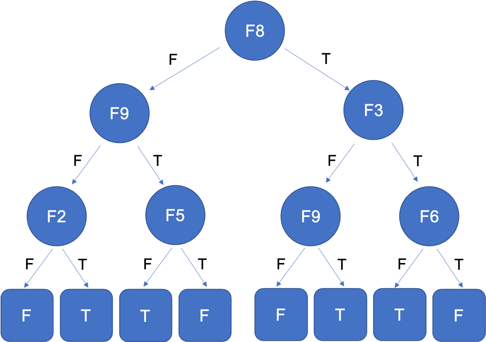

# Oracle-based Decision Tree Evaluation
OracleDTEval is an oracle-based decisoin tree evaluation tool. It consists of generating data from reference trees playing the role of oracles, producing learned trees with existing learning algorithms, and determining the degree of correctness (DOE) of the learned trees by comparing them with the oracles. The average DOE is used to estimate the quality of the learning algorithms. 

Our work is implemented and tested under Ubuntu 18.04. 

## Build 
To build the project, please first go into the `src/` directory and execute the Makefile:
```bash
cd src/
make all
```
If you would like to remove the intermediate files created when executing the Makefile, you can do so by running:
```
make clean
```

## Run 
To run the project, please go back to the root directory of this repo (this means, if you came from the previous "Build" process, run `cd ..` in terminal). 

Then you need to make changes to the following variables in the `execute.pl` file according to your needs. We don't recommand changing other variables in the perl script because it may break the program.

| Variables     |  Description   |  Default Values   | 
| ------------- | :-- | :-- | 
| features | the number of features | 10 |
| values   | the number of values per feature | 2 |
| opt   | the type of generating dataset, 0 = completely random dataset, 1 = uniquely random dataset | 0 |
| ini   | the minimum size for generated datasets  | 200  |  
| inf   | the maximum size for generated datasets  |  5000  |  
| step  | the incrementation value for the size of generated datasets  |  200  |  
| depi  |  the minimum depth for generated oracles  |  5  | 
| depf  | the maximum depth for generated oracles  | 9 | 
| phf   | the number of trials per configuration  |  100  | 
| sna   | the seed number to be set for randomization |  2529184780  |
| prog2 | the decision tree inference program to be evaluated | weka.classifiers.trees.J48 |

#### Evaluating Decision Tree Algorithms in WEKA
In our experiments, we used the decision tree inference algorithms implemented in [WEKA](https://www.cs.waikato.ac.nz/ml/weka/). If you want to do the same, please follow the these steps:
1. Download WEKA zip archive on [SouceForge](https://prdownloads.sourceforge.net/weka/weka-3-8-5-azul-zulu-linux.zip)
2. Upzip the file, and a new directory will be created. Change into this directory and run `pwd` in terminal to get the absolute path of this directory. In this instruction, we use `{WEKA_PATH}` to indicate this path.
3. In `execute.pl` file, change the classpath in `$prog2` variable to **{WEKA_PATH}/weka.jar**. After the motification, this line in the Perl script now becomes:
   ```
   my $prog2 = "java -classpath '{WEKA_PATH}/weka.jar' weka.classifiers.trees.J48 -U -M 1";
   ```
   Note that the `-U` flag indicates that we are producing an unpruned J48 tree from weka. And the `-M 1` flag at the end indicates the minimum number of instances in each leaf is set to 1 (in other word, expand the tree fully till each leaf only contains one class). For more options, please check WEKA's [J48 documentation](https://weka.sourceforge.io/doc.dev/weka/classifiers/trees/J48.html). 

4. If you want to evaluate another decision tree implemented in WEKA, change the classifer name in `$prog2` variable to the one you want. Please refer to WEKA's [package wiki](https://weka.sourceforge.io/doc.dev/weka/classifiers/trees/package-summary.html) for list of build-in tree classifiers. To use classifer packages not in this list, such as ID3 and SimpleCart (WEKA's implementation of CART algorithm), you need to add them first. You can refer to [StackOverflow](https://stackoverflow.com/questions/48888463/weka-3-8-package-installation-what-are-the-steps-to-add-id3) for instruction. And to correctly run the newly installed algorithms, we need to add `weka.Run` when executing the program. The line in the Perl script will be (similar to):
   ```
   my $prog2 = "java -classpath '{WEKA_PATH}/weka.jar' weka.Run weka.classifiers.trees.Id3";
   ```

#### Evaluating Other Decision Tree Algorithms
To evaluate other decision tree algorithms, such as your own customized decision tree algorithm, change the `$prog2` variable to the your program's executeble. For example, if your program's executeble is located in the current directory, change the line to:
```
my $prog2 = "./{YOUR_PROGRAM}";
```
**Note**:
Please make sure that your decision tree algorithm only produces the inferred tree in Standard Output, and please format your tree as the example shown below. 
```
F8 = F
|   F9 = F
|   |   F2 = F: F
|   |   F2 = T: T
|   F9 = T
|   |   F5 = F: T
|   |   F5 = T: F
F8 = T
|   F3 = F
|   |   F9 = F: F
|   |   F9 = T: T
|   F3 = T
|   |   F6 = F: T
|   |   F6 = T: F
```
This example tree has a depth of 3, which means each path of the tree has 3 features. Because each feature contains binary values, we use "T" (for true) and "F" (for false) to represent the value choices. The values after the colons ("**:**") indicates the resulting value in leaves.

The example tree output above can be illustrated as:



After configuring the Perl script, you can now run the program:
```bash
perl execute.pl
```

## Results
After the evaluation process finishes, all temporary files and directories created during execution will be removed. Only the `doe` directory is saved, and you can find the average DOE results there. 
